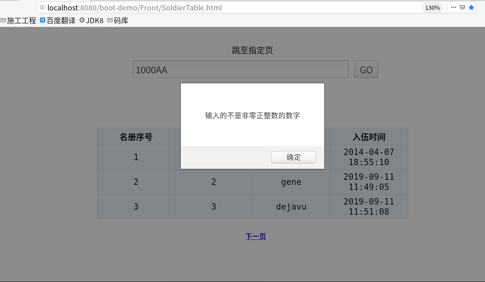
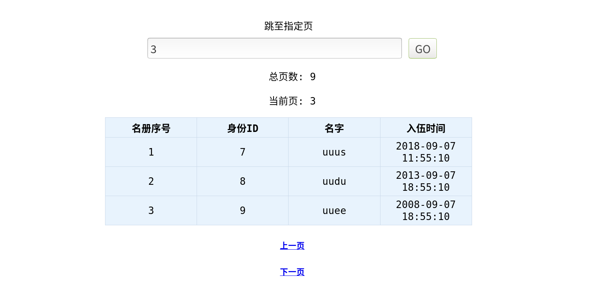
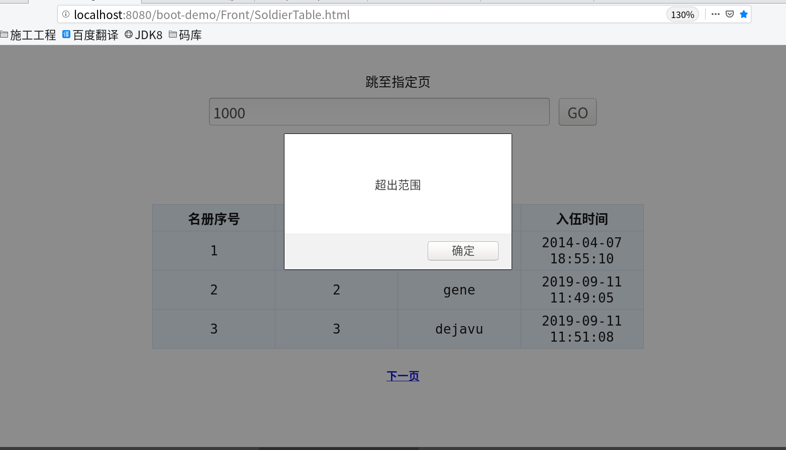
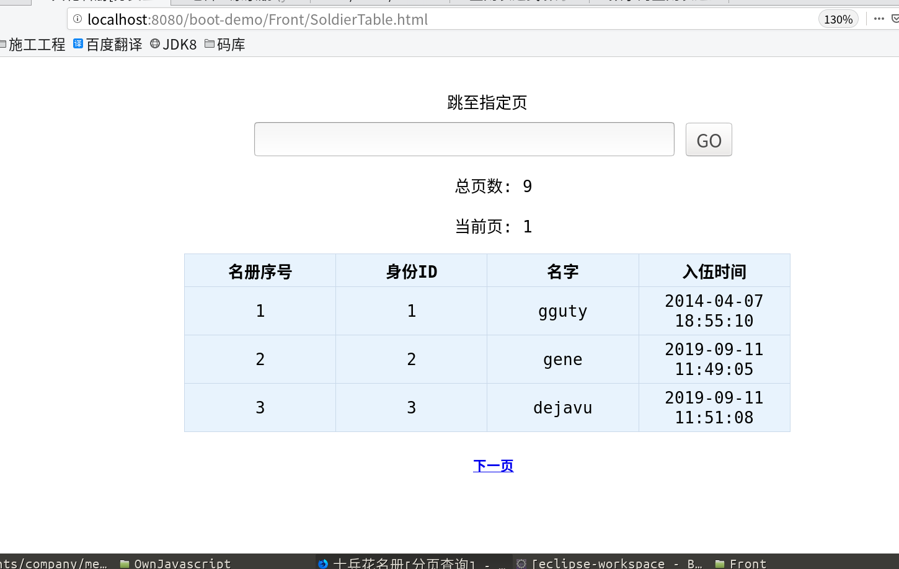
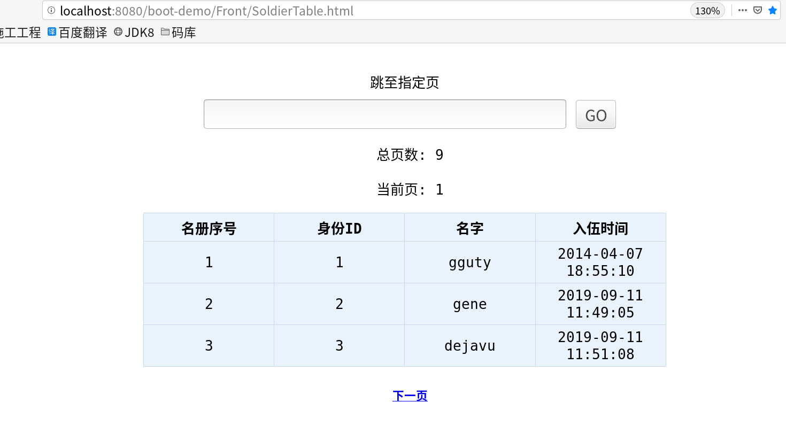
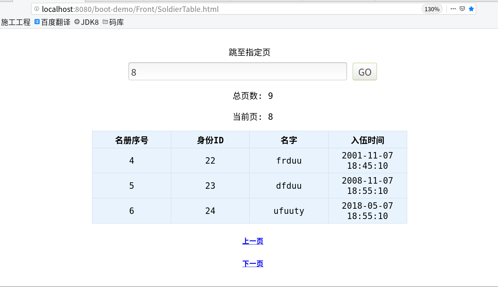
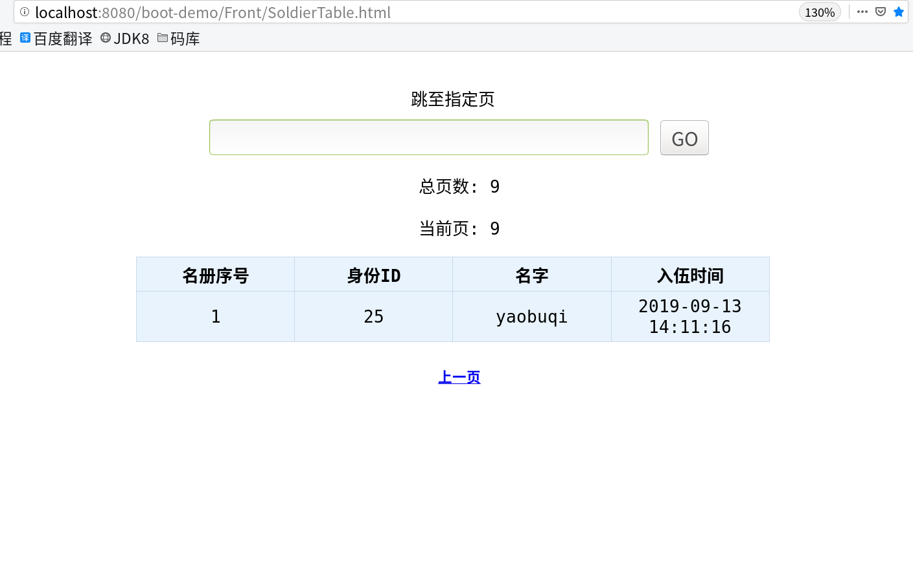

# 简介

依靠pagehelper技术实现的分页查询项目小案例

___________________________________________________

## 应用技术

* Web框架:SpringBoot 
* ORM框架:Mybatis-Plus
* 数据源:HikariCP
___________________________________________________

## 编程语言

-  后台:Java+MySQL
-  前台:HTML+CSS
-  脚本语言:JavaScript+JQuery
___________________________________________________

## 工具和环境

+ 编码工具:Eclipse+Sublime
+ 编码环境:Ubuntu Linux
___________________________________________________

## 实现功能

<ol>
<li>下一页查询,当没有下一页数据时,隐藏下一页地址标签
<li>上一页查询,当没有上一页数据时,隐藏上一页地址标签
<li>指定页数查询,输入1个数字,便跳转至指定页
</ol>

___________________________________________________

## 图片

				

				

				

				

				

